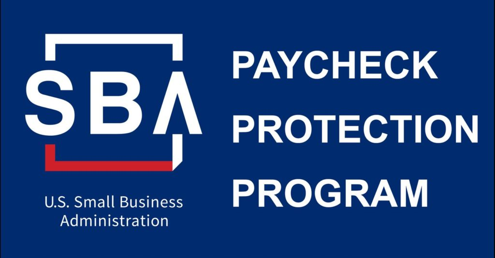
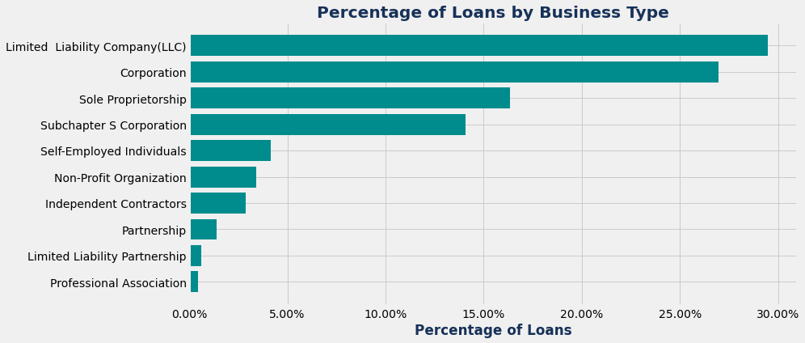
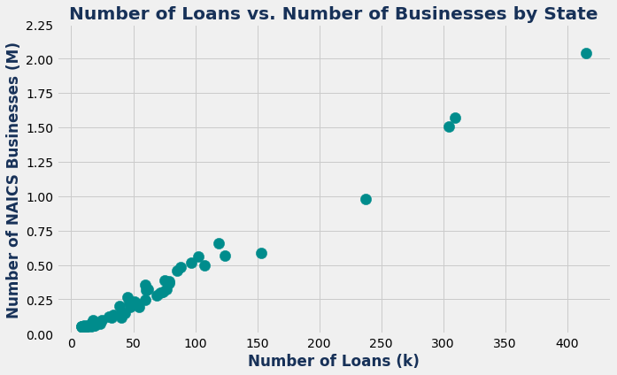
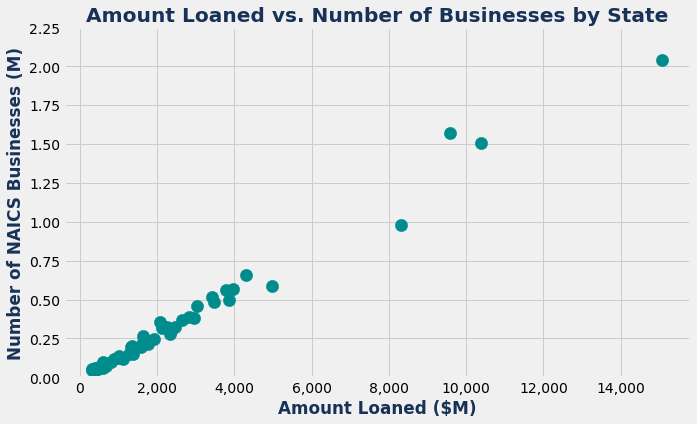
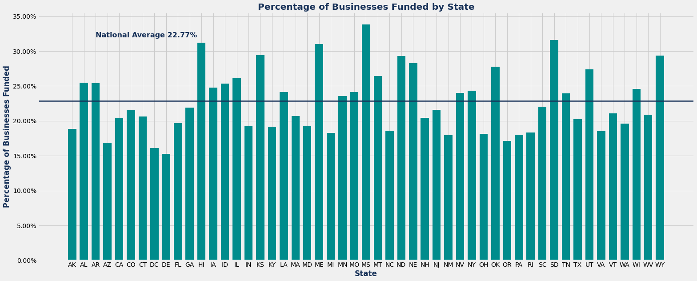
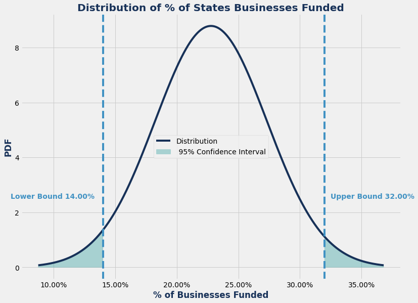
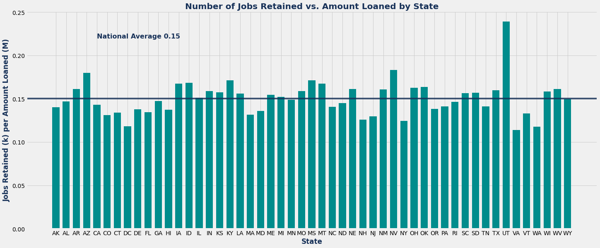
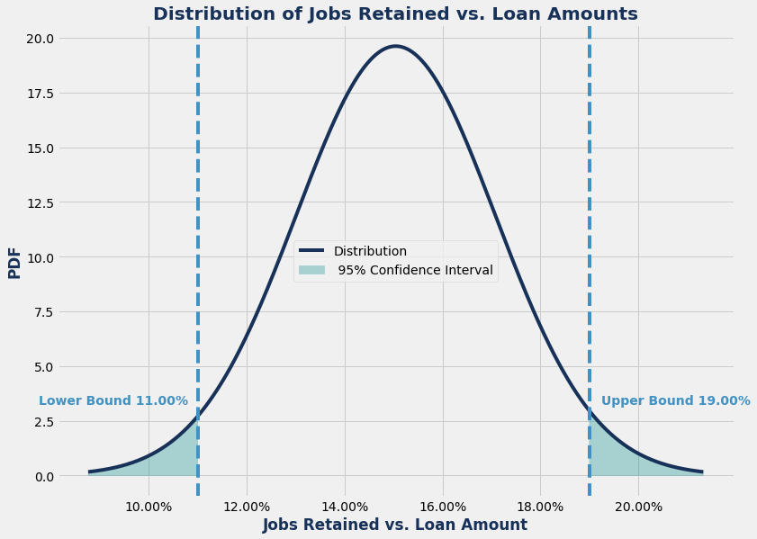
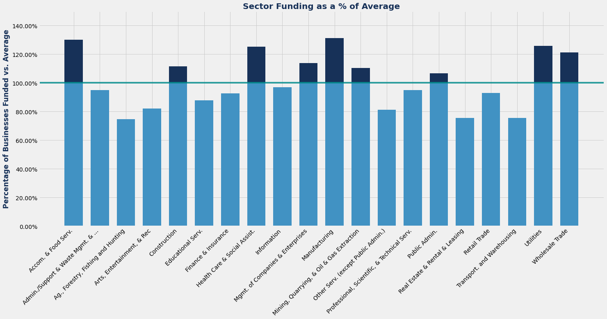

# PPP Loan Analysis
## A look at the distribution of Paycheck Protection Program (PPP) loans.

## Background:
The Coronavirus Aid, Relief, and Economic Security [(CARES)](https://home.treasury.gov/policy-issues/cares) Act was signed into law on March 27th, 2020 in the midst of the COVID-19 global pandemic which sent shockwaves through the U.S.(and global) economy. Within the CARES Act was a provision called the Paycheck Protection Program (PPP), which was designed to loan money to small businesses to provide them with the resources needed to maintain their payroll, hire back employees who may have been laid off, and cover applicable overhead. Initially, $349B was allocated to the PPP program, however, after the program ran out of funding in two weeks (processing 14 years’ worth of loans), congress replenished the program with an [additional $320B.](https://thehill.com/homenews/administration/493910-white-house-congress-reach-deal-to-replenish-small-business-loan)

## Motivating Question(s):
What was the distribution of PPP loans?
* Did certain states disproportionately benefit from the PPP loan program?
* What was the relationship between jobs retained and the loan amount?
* Did certain sectors or industries receive more or less funding than others?

## The Data:
The data was made available through the Small Business Administration (SBA) [website](https://www.sba.gov/funding-programs/loans/coronavirus-relief-options/paycheck-protection-program), the governmental agency tasked with the implementation of the PPP program (along with participating lenders). Initially, the SBA only released loan data for companies that received loans of less than $150k. However, after mounting pressure from Congress, governmental oversight agencies, and outside groups, the SBA released loan data for companies that received a loan of more than [$150k.](https://fortune.com/2020/06/22/ppp-loan-transparency-biggest-loans-companies-nonprofits-recipients/) 

There are several major differences between the two datasets: 1) Publicity: The $150k+ dataset contains two additional columns of data `BusinessName` and `Address`. Businesses which received loans of less than $150k were not named publicly. 2) Loan Specifics: Loans of less than $150k were stated as exact loan amounts. Loans for more than $150k were split into 5 buckets: `$150,000 - $350,000` , `$350,000 - $1 million` , `$1 million - $2 millon` , `$2 million - $5 million` , and `$5 million - $10 million`. 3) File Structure: The sub $150k loan data was made available through 57 separate `.csv` files (One for each state along with: American Samoa, Guam, District of Columbia, Northern Mariana Islands, Puerto Rico, Virgin Islands, and Other). The $150+ loan data set was aggregated and made available into one `.csv` file. 4) Data Size: The uncleaned dataset for loans over $150k contains *661,218 loans*, while the consolidated uncleaned sub $150k dataset contains *4,183,916 loans* *(as of 06/30/2020)*. For the purposes of this analysis, I will only be looking at the sub $150k dataset.

## Steps:
### 1. Inital Exploratory Data Analysis (EDA):
My initial EDA looked at a single state (Colorado) in order to get a feel for the data and columns. The sub $150k dataset contains 14 columns: `LoanAmount`, `City`, `State`, `Zip`, `NAICSCode`, `BusinessType`, `RaceEthnicity`, `Gender`, `Veteran`, `NonProfit`, `JobsRetained`, `DateApproved`, `Lender`, and `CD` (CD = Congressional District). At first glance, it became clear that some of the columns offered very little information. The `RaceEthnicity`, `Gender`, and `Veteran` columns seemed especially sparse in terms of responses. Once I consolidated all of the sub $150k data, this became even more clear. The table below summarizes the lack of responses on the cleaned sub $150k dataset. 

|   Loan Field   | % Unanswered |
|:--------------:|:------------:|
| Rece/Ethnicity |    89.02%    |
| Gender         |    77.62%    |
| Veteran        |    85.06%    |

The `NonProfit` column seemed to exhibit a similar lack of information like the `RaceEthnicity`,`Gender`, and `Veteran` columns, except Non-Profit companies were marked `Y` while For-Profit companies showed up as `null` values. After resolving/cleaning the `NonProfit` column, it became clear just how skewed the data was towards For-Profit organizations. The table below shows the For-Profit/Non-Profit breakdown on the entirety of the cleaned dataset.

|    Entity  | % of Loans |
|:----------:|:----------:|
| For-Profit |   96.55%   |
| Non-Profit |    3.45%   |

The one column I knew at first glance I had no interst in touching was `CD` Congressional District. Given today's political climate, I had zero interest in doing any analysis tied to politics. I also believe the confounding variables surrounding Coronavirus and the PPP program itself make the datapoint incredibly messy to analyze.

Looking at the remaining columns, there were several that had good data, but I felt didn't fit my motivating question(s) and would take more time than was alloted for the scope of this project: `City`, `ZIP`, and `Lender`, which had *33,588*, *35,403*, and *4,856* unique values, respectively, in the cleaned sub $150k dataset. For a single state or a more specific analysis, these columns would likely be valuable elements.

The `BusinessType` column contained 17 unique values: `Rollover as Business Start-Ups (ROB)`, `Employee Stock Ownership Plan(ESOP)`, `Joint Venture`,`Tenant in Common`, `Trust`, `Non-Profit Childcare Center`, `Cooperative`, `Professional Association`, `Limited Liability Partnership`, `Partnership`, `Independent Contractors`, `Non-Profit Organization`, `Self-Employed Individuals`, `Subchapter S Corporation`, `Sole Proprietorship`, `Corporation`, `Limited Liability Company(LLC)`. The breakdown of loans by business type was particularly top heavy, not surprising, with the top 10 business types making up 99.78% of loans.

### 2. Merging, Importing and Cleaning
My first step in dealing with the sub $150k dataset was to merge all of of the `.csv` values into one master `.csv`. I first downloaded and unziped the `.zip` file from the SBA, then placed the individual files into one master folder and merged them together using `cat *.csv > master.csv`. For the purposes of this analysis I was only interested in looking at the 50 U.S. states along with District of Columbia (D.C.). Once I had my master `.csv` I used Docker images provided by Jupyter Docker Stacks to create and start a container with Spark and PySpark.

After importing the `master.csv` file and checking the schema to make sure it lined up with the columns from my EDA, I was able to see that the uncleaned dataset contained *4,183,916 loans*. My first step was to clean up the `NonProfit` column by changing all of the `null` values to `N` (indicating For-Profit businesses). Next, I wanted to drop all remaining `null` values from the database. After cleaning the `null` values I was left with *3,789,024 loans*, a loss of *394,892 loans* leaving *approx ~ 91%* of the original dataset.

Next, I wanted to incorporate data from the North American Industry Classification System [(NAICS)](https://www.census.gov/eos/www/naics/). The NAICS is the standard used by Federal statistical agencies in classifying business establishments for the purposes of collecting, analyzing, and publishing statistical data related to the U.S. business economy. One column of the loan database contained a 6-digt NAICS code. The NAICS heiracrchy is generally thought about in three tiers: 

  * 2-digit Sector Code
  * 4-digit Industry Group Code 
  * 6-digit Industry Code. 

The 2-digit sector codes contain 24 unique values, which map to 20 unique sectors. The 4-digit industry group codes contain 311 unique values and industry groups, and the 6-digit industry codes contain 1045 unique values and industries. This analysis contains 20 unique sectors, 310 unique industry groups, and 1045 unique industries *(Industry Group code 8141 and Industry 814110, both indicating Private Households are not present in this dataset, as expected)*. 

The NAICS data was made avilable through their [website](https://www.naics.com/) and represents data from 2017 *(the most recent)*. From the NAICS I was able to pull the number of businesses by sector, industry group, industry, and state. After collecting the data, I created new columns in my PySpark dataframe for the NAICS 2 and 4 digit codes, along with corresponding names for the 2-digit sectors, 4-digit industry codes,and 6 digit industries. The NAICS data was then imported into new dataframes in PySpark and joined with the existing dataset. Once I had incorporated all of the NAICS data into my existing dataset I again cleaned out all `null` values, which removed 95,671 loans leaving me with a final cleaned dataset of *3,693,353 loans* *(~88.28% of the original uncleaned dataset)*.

### 3. Analysis & Data Subsets
After getting my data cleaned I next wanted to look at several subsets of the data in order to answer my motivating questions: state data, sector data, industry group data, and finally industry group data.

### State Data:
My fist steps in looking at the state data was to examine the relationships between the number of businesses in each state vs. 1) the number of loans 2) the amount loaned. What does this relationship look like? Are there any/many outliers?

Next I wanted to examine the percentage of businesses in each state that were funded. Again, is the distribution fairly uniform or are there outier states?

Finally, I wanted to examine the ratio of jobs retained vs. the amount loaned. This can be thought of an efficiency or 'bang-for-your-buck' metric.

### State Relationships:

Looking at the state data I was a little taken aback at how linear the relationship was between the number of loans per state and the number of busineses per state. Part of me thought that states hardest hit by COVID-19 would be potential outliers compared to other states.

        

Given the relationship of the first chart, it wasn't too surpising to see that the amount of loans per state had a similarly linear relationship with the number of businesses in each state.

Looking at the percentage of businesses that received funding in each state, the distribution was a little less uniform than I was expecting given the fairly tight linear relationships seen above. As well, some of the states hit hardest by COVID-19 (ex. Connecticut, New Jersey and Massachusetts) were below average in terms of the percentage of the state's businesse which received funding. 

To further explore this idea, I decided to look at a probability density function (PDF).

I decided to use a 95% confidence interval for the distribution and found that every state fit within the 95% confidence interval, except for one: Mississippi. Mississippi had 33.85% of it's businesses funded, well above the upper bound of the PDF. Mississippi's cumulative distribution fuction (CDF) indicates a likelihood of 0.74% that Mississippi would receive that much funding as a percentage of the state's businesses. However, Mississippi has the [highest poverty rate](https://en.wikipedia.org/wiki/List_of_U.S._states_and_territories_by_poverty_rate) of any state in America and PPP is a government program, so in this case the outlier seems to have some justification. 

Finally, in examining my 'bang-for-the_buck' metric, I noticed a fairly uniform distribution. The distribution appeared to have less variability than the percentage of businesses funded by state. However, there did appear to be one major outlier, Utah.

Again, to further explore this outlier, I decided to look at a probability density function (PDF).

I used a 95% confidence interval, same as before, and again found that every state fit within the 95% confidence interval, except for Utah. Utah's ratio of Jobs Retained (per thousand) to Loan Amount Received (per million) came in at 0.2389. According to the CDF, this indicates a likelihood of 0.007%. There wasn't anything that stood out to me in particular about Utah, but after digging deeper, it appears that a substantial portion *approx ~ 20%* of the state's PPP money was lent out by one bank, Zions Bank, which is headquartered in Salt Lake City and is the [largest full-service commerical bank in Utah](https://www.sec.gov/Archives/edgar/data/109380/000010938020000092/zions-20191231.htm) and outnumbers both JPMorganChase and Wells Fargo in number of branches within the state.  

### Sector Data & Analysis:
After examining the state data, I next took a look at the NAICS sector data an specifically looked at a breakdown of sectors vs. the average loan.

It was not surprising to see sectors like Construction, Food Services, Health Care, and Manufacturing come in above average in terms of loan amounts given how these sectors were affected by COVID-19. The one sector I was surprised to see on the low end was Tranportation and Warehousing. It would seem to me that in a world with mandated shutdowns that the trasportation sector would be struggling.

### Industry Group Summary:

#### Top 10 Industry Groups

|                NAICS Industry Group               | Industry Group Funding as a % of Average |
|:-------------------------------------------------:|:----------------------------------------:|
| Spring and Wire Product Manufacturing             |                  186.66%                 |
| Foundries                                         |                  180.39%                 |
| Resin, Synthetic Rubber, and Artificial and Sy... |                  175.05%                 |
| Plastics Product Manufacturing                    |                  171.90%                 |
| Offices of Dentists                               |                  170.52%                 |
| Cement and Concrete Product Manufacturing         |                  168.09%                 |
| Forging and Stamping                              |                  167.87%                 |
| Steel Product Manufacturing from Purchased Steel  |                  167.81%                 |
| Iron and Steel Mills and Ferroalloy Manufacturing |                  167.74%                 |
| Metalworking Machinery Manufacturing              |                  164.00%                 |

#### Bottom 10 Industry Groups

|                NAICS Industry Group               | Industry Group Funding as a % of Average |
|:-------------------------------------------------:|:----------------------------------------:|
| Taxi and Limousine Service                        |                  32.62%                  |
| Other Transit and Ground Passenger Transportation |                  46.19%                  |
| Independent Artists, Writers, and Performers      |                  47.40%                  |
| Personal Care Services                            |                  47.51%                  |
| Oilseed and Grain Farming                         |                  52.01%                  |
| Fishing                                           |                  52.01%                  |
| Offices of Real Estate Agents and Brokers         |                  58.48%                  |
| Poultry and Egg Production                        |                  59.71%                  |
| Hunting and Trapping                              |                  59.86%                  |
| Sheep and Goat Farming                            |                  64.48%                  |

### Industry Summary:

#### Top 10 Industries

|               NAICS Industry              | Industry Funding as a % of Average |
|:-----------------------------------------:|:----------------------------------:|
| Softwood Veneer and Plywood Manufacturing |               250.10%              |
| Kaolin and Ball Clay Mining               |               231.83%              |
| Cane Sugar Manufacturing                  |               217.58%              |
| Polystyrene Foam Product Manufacturing    |               217.55%              |
| Paperboard Mills                          |               215.22%              |
| Truss Manufacturing                       |               201.25%              |
| Powder Metallurgy Part Manufacturing      |               199.86%              |
| Spring Manufacturing                      |               199.61%              |
| Steel Foundries (except Investment)       |               199.14%              |
| Aluminum Foundries (except Die-Casting)   |               197.81%              |

#### Bottom 10 Industries

|           NAICS Industry          | Industry Funding as a % of Average |
|:---------------------------------:|:----------------------------------:|
| Silver Ore Mining                 |               24.63%               |
| Taxi Service                      |               26.80%               |
| Photography Studios, Portrait     |               37.66%               |
| Barber Shops                      |               37.96%               |
| Beet Sugar Manufacturing          |               38.00%               |
| Other Urban Transit Systems       |               42.91%               |
| Limousine Service                 |               44.36%               |
| Footwear and Leather Goods Repair |               44.49%               |
| Shellfish Fishing                 |               45.29%               |
| Beauty Salons                     |               45.83%               |

## Wrap-Up and Further Analysis:
The sub $150k PPP loan dataset is quite extensive. I wish I could have dug a little bit deeper into the NAICS data to get a better idea of the underlying distribution of PPP money. I also would have liked to get a choropleth map together to examine variables throughout the U.S. (either by state, city, or zip code) and possibly incorporate COVID-19 data. Additionally, pulling in population data would be interesting to see how things are broken down on a per capita basis. There are a lot of different ways to slice the data.
